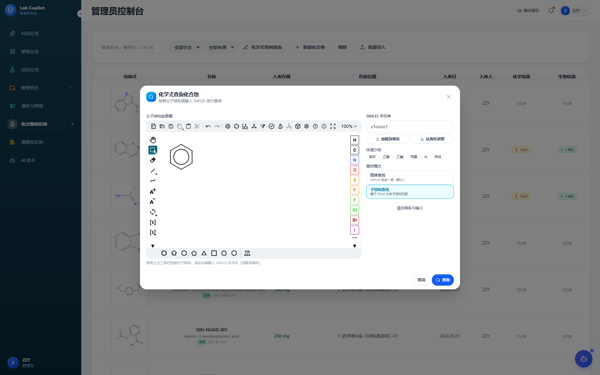

# Lab Copilot

**面向化学、药物化学与生物活性研究课题组的 AI 科研协作平台。** Lab Copilot 将化合物结构、合成记录、生物活性数据、试剂库存与课题协作集中管理，让组内积累的数据既能被查找，也能被 AI 助手用于日常科研问答。

支持课题组在自己的电脑、校内服务器或云服务器上部署，也可通过[在线服务](https://labcopai.com)申请使用。项目以化合物相关研究为当前重点，并欢迎其他领域课题组共同探索适合自身工作的定制版本。

在线服务：[labcopai.com](https://labcopai.com)。社区源码版本：`v0.1.0`；[发行说明](docs/release-notes.md)。使用指南含 64 张线上实拍截图，覆盖绘图查询、化合物录入、课题进度、周报及管理功能。账号需按实例流程申请，仓库不包含线上数据和账号凭据。

## 面向专业科研场景

| 适用方向 | 可以开展的工作 |
| --- | --- |
| 有机合成与药物化学 | 建立组内化合物库，结合分子结构查找化合物，整理合成路线、批次、反应条件、收率、纯度与表征摘要 |
| 药物筛选与生物活性研究 | 记录和查询 IC50、MIC、抑菌率、细胞毒性等活性数据，按靶点、细胞系或菌株查找相关化合物与结果 |
| 课题组日常协作 | 管理试剂库存与领用审批、设备预约、巡检资质、课题任务、甘特图、周报和文档版本 |



完整操作示例见[带截图的使用指南](docs/user-guide.md)，包括化合物录入、绘图查询、课题进度和管理功能。

## 能查询组内数据的 AI 科研助手

AI 助手通过受权限约束的只读工具查询课题组已有记录，结合文字、图片和文档输入辅助科研工作。以下示例需要组内已有相应数据，并完成模型服务配置。

| 实用场景 | 可以这样提问或操作 |
| --- | --- |
| 查化合物与库存 | “帮我查一下这个 CAS 对应的化合物和库存。”支持名称、内部编号、CAS 与 SMILES 查询 |
| 从结构开始提问 | 在对话中绘制分子并插入 SMILES，查询同一结构对应的记录；结构查询使用 RDKit 规范化精确匹配 |
| 查生物活性 | “XY-001 有哪些活性测试结果？”查询已有 IC50、MIC、细胞毒性等记录 |
| 按研究对象找结果 | “组内哪些化合物有针对 EGFR 的活性结果？”按靶点、细胞系或菌株检索 |
| 回顾合成工作 | “查一下 XY-001 的合成批次、反应条件和收率。”整理已录入的路线与批次记录 |
| 查试剂使用信息 | “这个试剂放在哪里、还有多少、是否过期？”查询位置、库存、危险等级及已录入的 MSDS/SOP 信息 |
| 辅助阅读与讨论 | 上传 PDF、DOCX、PPTX 或文本资料，辅助提取要点、整理问题；配置视觉模型后可结合图片讨论 |

助手可用本地 RDKit 展示 SMILES 对应的分子结构。查询结果受账号权限与已录入数据限制，资料解读和生成内容仍需科研人员核验；文件读取范围见[功能指南](docs/product-guide.md)。


## 部署与使用

- [新手部署指南](docs/self-hosting-guide.md)：本机、校内服务器、云服务器和快捷脚本。
- [带截图的使用指南](docs/user-guide.md)：功能、角色和实际操作流程。
- [功能与使用边界](docs/product-guide.md)、[安全与限制](docs/security-and-limitations.md)。
- [贡献说明](CONTRIBUTING.md)。

本项目为单机单应用实例，SQLite与进程内调度不支持直接扩为多个应用副本。模型调用需要自行配置服务和凭据，不包含模型额度。先通过部署指南中的验收步骤，再保存真实课题资料。

Linux/macOS已安装Python3.9+、Docker和Compose2.30+后：

```sh
sh deploy/setup.sh init --mode local --admin-email admin@example.org
sh deploy/setup.sh up
```

Windows在项目目录使用`python deploy/selfhost.py init --mode local --admin-email admin@example.org`和`python deploy/selfhost.py up`，或使用`deploy/setup.ps1`。

Linux由管理员使用`sudo sh deploy/setup.sh ...`；已经是root时无需sudo。macOS使用普通终端。数据与证书权限、备份和目标环境验收见部署指南。

许可：GNU AGPLv3 only（`AGPL-3.0-only`），见[LICENSE](LICENSE)。支持收费部署、维护和定制；修改后的网络服务应按许可向使用者提供对应源码。第三方组件保留其原许可证。

维护者：[Zzy522](https://github.com/Zzy522)，微信`jingzbdcjl`。

## 欢迎开发者参与

欢迎通过 [Issue](https://github.com/Zzy522/labcop/issues) 反馈问题、讨论需求，或提交 Pull Request。我们尤其欢迎对化学信息学、AI 智能体、科研数据管理、前后端开发、部署运维和交互设计感兴趣的开发者加入。

可以从完善部署文档、修复使用问题、补充测试、改进结构检索与数据导入、完善助手工具或探索其他领域的数据模型开始。较大的功能请先通过 Issue 讨论使用场景和实现范围。参与前请阅读[贡献说明](CONTRIBUTING.md)与[开发者指南](docs/developer-guide.md)；示例和测试数据请使用脱敏或合成数据。

## 课题组合作与领域定制

欢迎化学、药学、生物等方向课题组参与试用与共建，围绕真实科研流程提出需求、反馈使用体验，共同完善化合物管理、活性数据整理和 AI 助手能力。

也欢迎材料、环境及其他类型课题组交流定制需求。可讨论领域数据字段与模板、样品或实验记录、审批流程、专业知识与智能体工具、已有系统对接，以及部署、迁移和维护服务。其他领域的适配范围需结合实际流程评估，并非当前版本已经内置的全部功能。

合作请联系维护者：[GitHub · Zzy522](https://github.com/Zzy522)，微信 **jingzbdcjl**。初次沟通可说明研究方向、团队规模、当前工作方式、部署环境和希望解决的问题。

社区版按 **AGPL-3.0-only** 发布，第三方组件保留原许可。支持辅助部署、维护与定制；交付版本的源码义务及另行授权范围按适用许可和贡献者授权处理，详见[贡献说明](CONTRIBUTING.md)与[第三方许可说明](THIRD_PARTY_NOTICES.md)。
